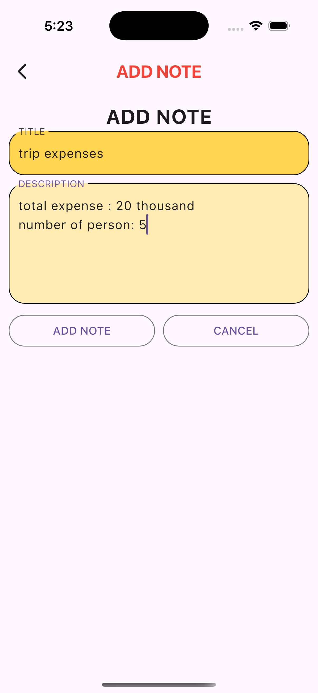
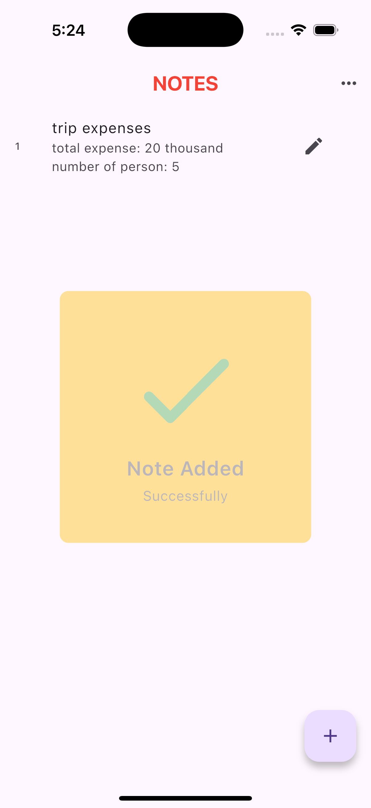
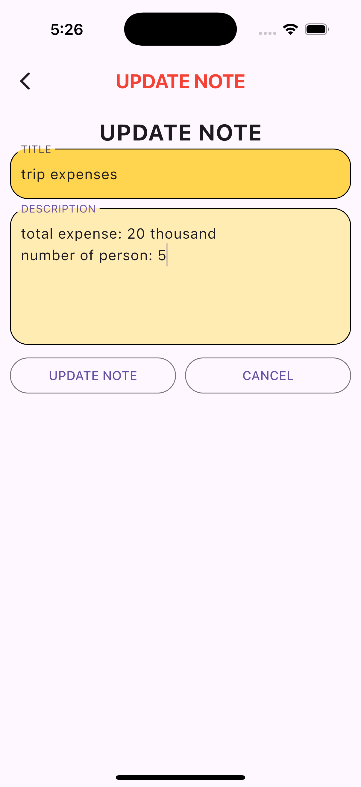
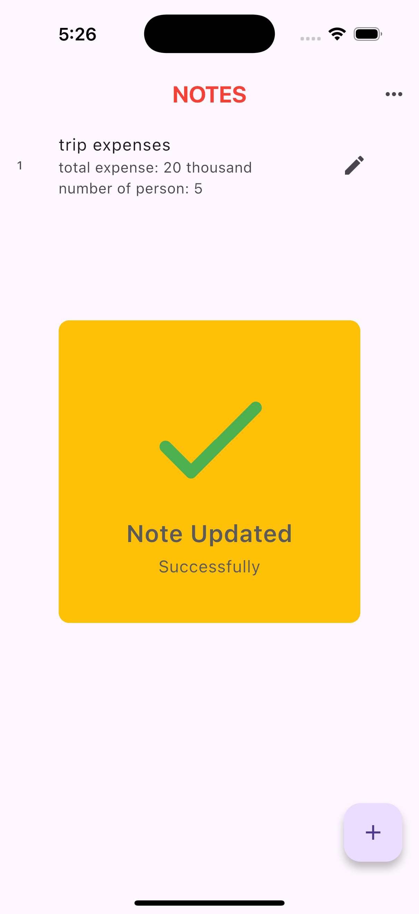
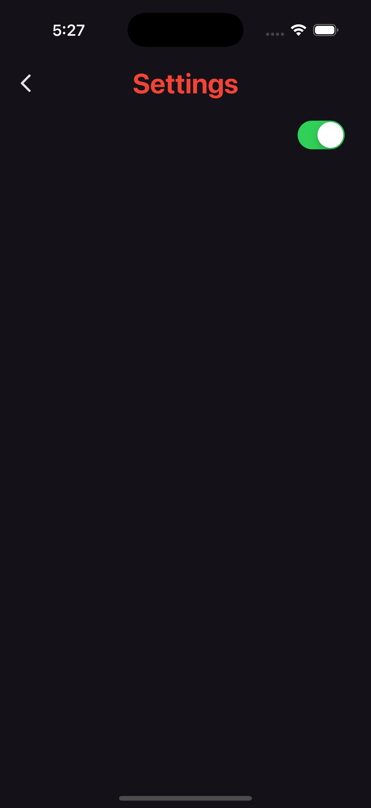
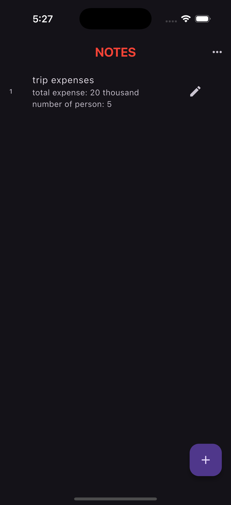

# 🗒️ Notes App

A Flutter-based note-taking application that allows users to seamlessly **add**, **edit**, and **delete** notes locally using **SQLite**. Built with clean architecture and **Provider** for state management, the app supports **Dark Mode** and offers a smooth and responsive user experience across Android and iOS.

---

## 📘 About Notes App

The Notes App is designed to demonstrate a clean, scalable Flutter project with local database handling using **SQLite**. It features a polished UI, local persistence, and reactive updates with **Provider** as the state management solution.

This project is part of a hands-on Flutter learning practice and showcases a strong foundation in **Flutter architecture**, **state management**, and **database integration**.

---

## ✨ Features

- 📝 Add, update, and delete notes in real-time.
- 💾 Store data locally using **SQLite** — even works offline.
- 🌙 Integrated **Dark Mode** support for better UI experience.
- 🔄 State management handled using **Provider** for responsiveness.
- 📂 Clean and scalable project structure following Flutter best practices.
- 🧑‍🎓 Created as part of a learning module on **local databases in Flutter**.

---

## 🛠️ Tech Stack

| Technology            | Description                                               |
|-----------------------|-----------------------------------------------------------|
| **Flutter**           | Cross-platform framework for building Android/iOS apps    |
| **Dart**              | Language used to build Flutter apps                       |
| **SQLite**            | Lightweight embedded database used for local persistence  |
| **Provider**          | State management solution used for reactive UI            |
| **Flutter Widgets**   | For building UI with Material design                      |

---

## 🧑‍💻 Contributions / What I worked on

- 🎨 Designed and built the entire UI for the Notes App using Material Design.
- 🔄 Implemented **Provider**-based state management for adding, updating, and deleting notes.
- 💾 Integrated **SQLite** to store notes locally.
- 🌙 Enabled **Dark Mode** toggle for theme switching.
- 🧱 Followed clean architecture principles and organized file structure.
- 🧪 Tested note operations across Android and iOS devices/emulators.

---

## 📸 Screenshots

<p align="center">
   &nbsp;
   &nbsp;
   <br><br>
   &nbsp;
   &nbsp;
  
</p>

---

## 🚀 Getting Started

1. **Clone the repository:**

    ```bash
    git clone https://github.com/whonikhilsethi/Notes-App-Flutter-Sqflite-Local-Database.git
    cd Notes-App-Flutter-Sqflite-Local-Database
    ```

2. **Install dependencies:**

    ```bash
    flutter pub get
    ```

3. **Run the app:**

    ```bash
    flutter run
    ```

---

## ✅ Prerequisites

- Flutter SDK installed on your system  
- Android Studio, Xcode, or a code editor like VS Code  
- Android Emulator or iOS Simulator (or real device)

---

## 📦 Dependencies Used

| Package              | Purpose                                      |
|----------------------|----------------------------------------------|
| [`sqflite`](https://pub.dev/packages/sqflite)         | Local database storage (SQLite) |
| [`path_provider`](https://pub.dev/packages/path_provider) | Access to local file paths      |
| [`provider`](https://pub.dev/packages/provider)       | Efficient state management       |

---

## 📧 Contact

For any questions or inquiries, feel free to reach out via email:  
📩 **nikhilsethi2k3@gmail.com**  
🔗 GitHub: [github.com/whonikhilsethi](https://github.com/whonikhilsethi)

---

## 📚 References and Resources

- [Flutter Documentation](https://docs.flutter.dev/)
- [Dart Language Guide](https://dart.dev/guides)
- [SQLite in Flutter](https://docs.flutter.dev/cookbook/persistence/sqlite)
- [Provider Package](https://pub.dev/packages/provider)
- [VS Code Flutter Extension](https://marketplace.visualstudio.com/items?itemName=Dart-Code.flutter)

---

⭐ *If you found this project useful, consider giving it a ⭐ on GitHub!*

